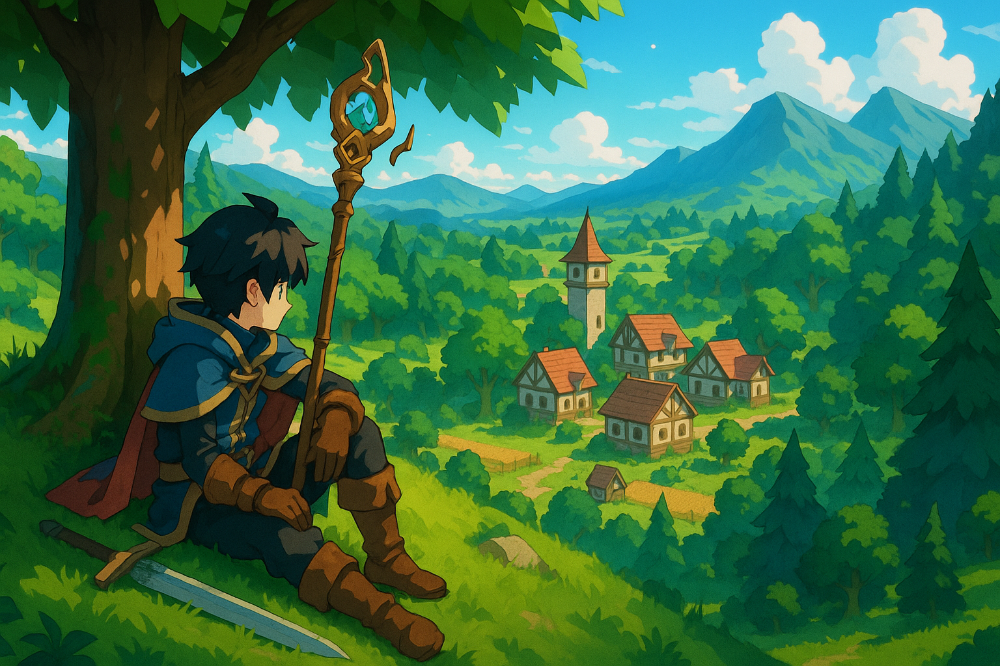

# Wander
Some game with cool installer?

This project has 4 applications
- **Wander** - The game
- **Installer** - Downloads new versions of the game. Can also automatically download hotfixes and hotreload them while the game is running.
- **Content Server** - Server where installer downloads game files from.
- **Website** - Website of the game where you download installer.

# Get started
Get started by either building project yourself or download the pre-built executables in [Releases](https://github.com/Emarioo/wander/releases).

Once you have the installer you can run it `installer.exe`. It will ask you where to install the game, default is `X`. Then just run the game and have some fun.

If you want to modify the game and have the running game automatically update assets and game code you should overwrite `game.dll`. It you are playing on a server and want everyone to also have their game updated then you would use the installer and content server. Upload your game files through installer. The content server will notify connected installers on your friends computer that a new version is available. If your friends enable auto-update then the installers will download the new game files automatically.

# Building
**Requirements**
- Download [BTB](https://github.com/Emarioo/BetterThanBatch) from its releases (or clone and build compiler).
  Put `btb.exe` in your PATH environment variable.
- Download Visual Studio or GCC (MinGW if on Windows)

## Installer
- Build with `build.py installer`
- Run with `bin\installer.exe`

## Wander
- Build with `build.py`
- Run with `bin\wander.exe`

## Website
- Build with `build.py website`
- Run with `bin\wander.exe`

## Content Server (for installer)
- Build with `build.py server`
- Run with `bin\server.exe`